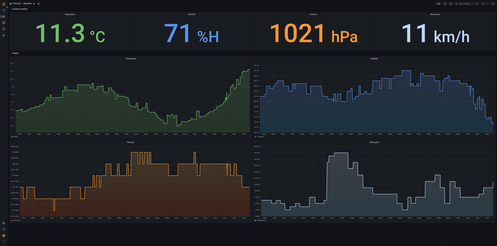
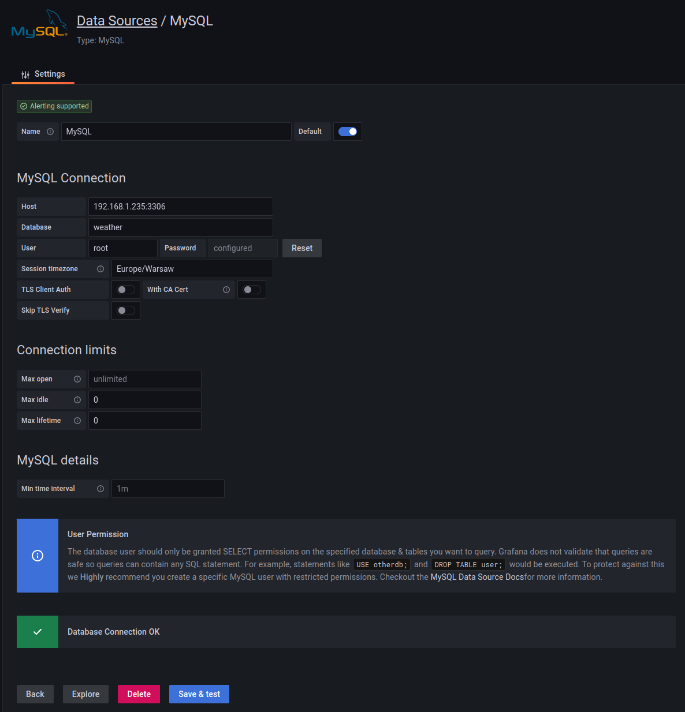

# Weather API Collector

## Table of contents

- [Introduction](#introduction)
- [Technologies used](#technologies-used)
- [Features](#features)
- [Screenshots](#screenshots)
- [Setup](#setup)

## Introduction

This project is simply API collector, which collects data from `https://openweathermap.org` API, saves data to the mySQL database and shows the data using `Grafana`.
All of software are running in Docker containers.

## Technologies used

- Backend - <b>node.js</b>.
- Database - <b>mySql</b> used with ORM <b>Sequelize</b>.
- Frontend - <b>Grafana</b>.

## Features

- Collecting data such as: temperature, humidity, pressure and wind speed for country you can choose. Application sends the API call in 1 minute interval.
- Save the data to mySql database.
- Visualize data on Grafana.

## Screenshoots

## Setup

To run the project (tested on Debian 11):

1. Make sure you have `docker` and `docker compose` installed.
2. Login to your server and clone the repository.
3. Enter the repo and search for `.env.example` file.
4. Put there all of informations.
5. Rename `.env.example` file to `.env`.
6. Run the containers by using `docker compose up -d` in main folder (includes `docker-compose.yml` file).
7. When docker compose process will end you can check containers by using `docker ps -a`.
8. When you run it first time, it takes about 5-10 min to load everything. In first moment `weather_api collector` container will restarting. That's because unable to connect to mySql database.
9. When collector container will stop restarting thats the sign everything is ready.
10. Go to grafana, by entering `HOST_IP:3000` in your browser.
11. Login as `admin`, default password is also `admin`.
12. Go to `Configuration --> Data Sources` and add `mySQL` data source. Mysql database is running at port `3306`. Save and test your database at the bottom of the site. Below example configuration:

13. Go to `Dashboards --> Import` and import the dashboard from the repositorium (`dashboards/weather.json`).
14. When the data is not showing up go to the every panel by clicking on title of the panel and then edit. Then in bottom left corner choose one more time `column` and the click `Run query`. The data should show in the center of the screen. Then click apply in the upper right corner. Repeat that for every panel.
15. Save changes to your dashboard in upper right corner.
